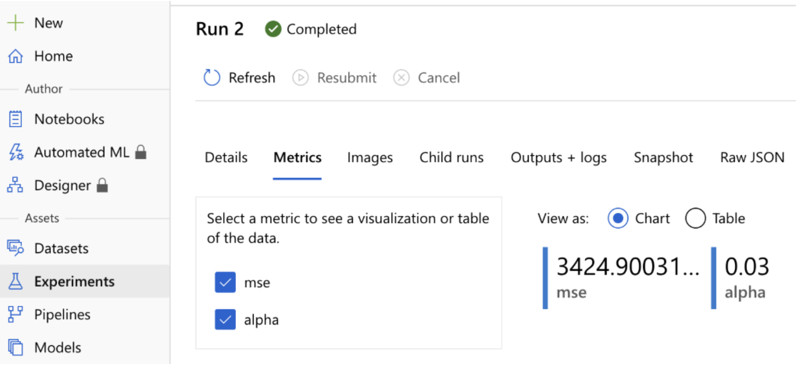
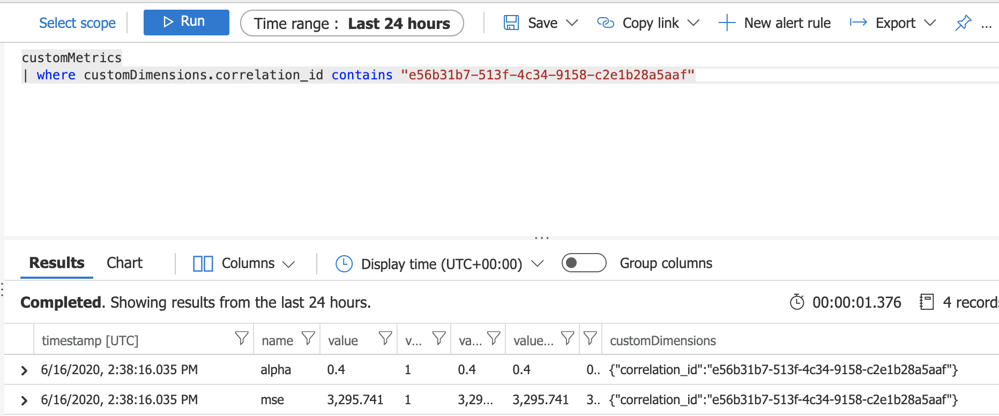
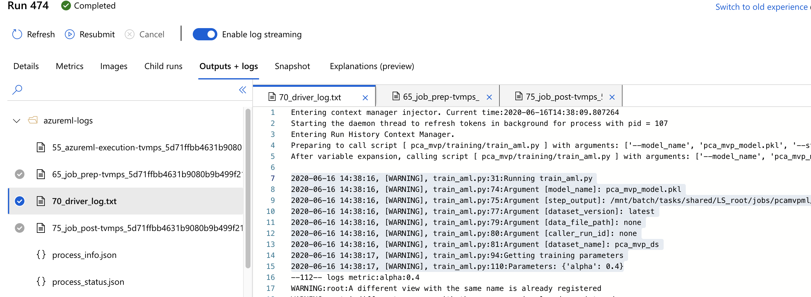
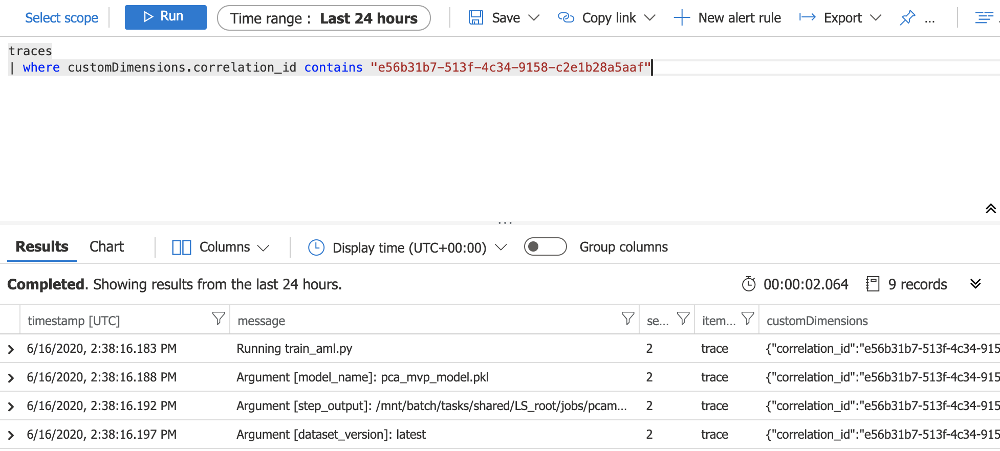

# How to use

Environment variables:

```bash
# Observability related
APPLICATIONINSIGHTS_CONNECTION_STRING = ''
LOG_TO_CONSOLE = 'false'
# DEBUG, INFO, WARNING, ERROR, CRITICAL
LOG_LEVEL = 'DEBUG' 
# Probability 0.0 -> 1.0
LOG_SAMPLING_RATE = '1.0'
# Probability 0.0 -> 1.0
TRACE_SAMPLING_RATE = '1.0'
# Seconds
METRICS_EXPORT_INTERVAL = '15'
```

Client code:
```python
from utils.logger.logger_interface import Severity
from utils.logger.observability import Observability

observability = Observability()

def main():
  observability.log("Hello")
  observability.log("Something is wrong", severity=Serverity.ERROR)
  observability.log_metric(name="metric1", value=100)
  observability.log_metric(name="metric2", value=200, log_parent=True)
  try:
    raise Exception("error")
  except Exception as ex:
    observability.exception(ex)

if __name__ == '__main__':
  observability.start_span('train_aml')
  try:
    main()
  except Exception as exception:
    observability.exception(exception)
    raise exception
  finally:
    observability.end_span()
```

## Observability Usage

To use the logger in your project: 

**1. dependencies:**

Observability requires the following dependencies. Make sure you add them into your project before the usage:
```yaml
      - opencensus==0.7.7
      - opencensus-context==0.1.1
      - opencensus-ext-azure==1.0.2
```  
Additionally, AppInsightsLogger needs the connection to AppInsights. Therefore make sure you add the Instrumentation key to the environment variables of the running environment:
```python
os.environ["APP_INSIGHTS_CONNECTION_STRING"] = "_____"
```
 

**2. Import Observability** 

Import Observability object in your script and create an object of Observability type.
Observability object, checks the context of the 
[Run](https://docs.microsoft.com/en-us/python/api/azureml-core/azureml.core.run(class)?view=azure-ml-py) object and if
 the context is **Online**, it will add **AzureMlLogger** to the list of loggers.
If  the Run context is offline, it will only add AppInsightLogger to list of loggers. 
```python
from util.logger.observability import Observability

observability = Observability()
```

**3. Log your message/metrics**


**3.1 log metrics:**
Below is the usage of **log_metric** method.
```python
observability.log_metric(name="alpha", value="2.1", description="value of alpha")
observability.log_metric(name="alpha", value="2.1", description="value of alpha", log_parent=True)
```
upon a call to _log_metric_:
- If the context of Run class is online, metrics will be sent to azure ML.
- Metrics will be sent to AppInsights as a custom metrics. 
Please note that metrics exporter sends the metrics at **export_interval** rate (in seconds) to 
AppInsights based on their last entered value. The default export_interval is 15 seconds.


**3.2 log messages:**
Below is the usage of **log** method.


```python
observability.log(description="value of alpha",severity=Severity.WARNING)
```
upon a call to _log_metric_:
- If the context of Run class is online, logs will be sent to azure ML.
- Logs will be sent to AppInsights. 


**4. check the logs/metrics**

Observability is sending the logs/metrics to AzureMl( in online context) and to AppInsights.

**Logs/Metrics Correlation:** 

The correlation_id is used to map specific Run/Build with the logs/metrics being sent  to different resources. 
Correlation_id will be created and added to telemetry processor in a custom dimension in following steps:

1. If the logging is happening in an **Online Run Context**,
the correlationId is similar to **RunId**

1. If the logging is happening in an **Offline Run Context**,
the correlationId is the same as the **buildId** of the Pipeline
(fetched from EnvVariable)

1. If the logging is happening in Offline Run Context and there
is no BuildId set to the Environment variable, it will will
be associated with a **unique identifier**.

**Check Metrics in Azure ML:**

To check the metrics in Azure ML, navigate to [Azure ML portal](https://ml.azure.com/), find your desired experiment
 and in the Metrics tab  you can see the logged metrics. 
 
 
**Check Metrics in  AppInsights:**

To check the metrics in Application Insights, navigate to Azure Portal and your application Insights service. 
Click on Logs tab and select custom Metrics. You may use the below queries to retrieve your metrics:
The following lists all the custom metrics:
```sql
customMetrics
```
To narrow your search to the  specific run you can provide the correlation_id:

```sql
customMetrics 
| where customDimensions.correlation_id contains "e56b31b7-513f-4c34-9158-c2e1b28a5aaf" 
```


**Check logs in  Azure ML:**

Logs will be sent to AzureML only in Online context. 
You can check the logs by logging in to [Azure ML portal](https://ml.azure.com/) portal. 
Then click on desired experiment and select the specific step.
click on logs/output tab and check your logs.
logs will be sent to Azure ML in the following format: 
```text
timeStamp, [severity], callee_file_name:line_number:description
```


**Check logs in  Application Insights:**

To check the logs in Application Insights, navigate to Azure Portal and your application Insights service. 
Click on Logs tab and select traces. You may use the below queries to retrieve your logs:
The following lists all the custom metrics:
```sql
traces
```
To narrow your search to the specific run you can provide the correlation_id:

```sql
traces
| where customDimensions.correlation_id contains "e56b31b7-513f-4c34-9158-c2e1b28a5aaf"
```

